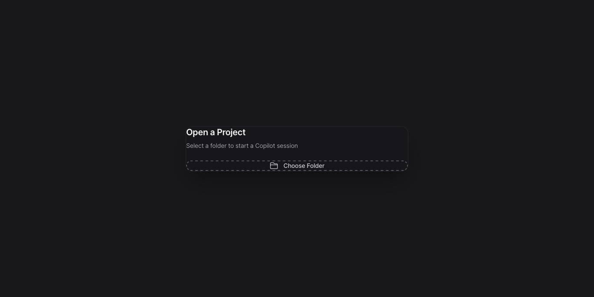
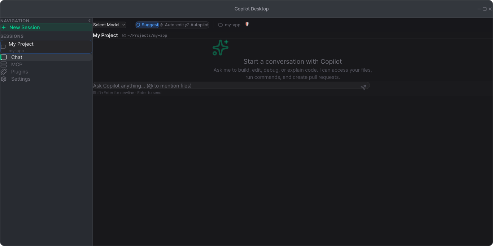

# Copilot Desktop

A modern, Codex-like desktop UI for [GitHub Copilot CLI](https://github.com/github/copilot-cli).

[](https://github.com/g97iulio1609/copilot-desktop/releases/latest)


## Screenshots

<p align="center">
  
  <br/><em>Login Screen — Sign in with your GitHub account</em>
</p>

<p align="center">
  
  <br/><em>Project Picker — Select a folder to start a session</em>
</p>

<p align="center">
  
  <br/><em>Main Chat View — Sidebar, model selector, mode switcher, and chat input</em>
</p>

## Overview

Copilot Desktop brings the power of GitHub Copilot CLI into a beautiful native desktop application. It wraps the `copilot` CLI as a child process, providing a rich graphical interface with streaming chat, file tree, diff viewer, session management, MCP server manager, and more.

## Features

- 🎨 **Modern macOS-native UI** — Custom titlebar, glass effects, dark theme
- 💬 **Chat Interface** — Streaming markdown with syntax highlighting
- 📁 **File Tree** — Real-time view of files modified by the agent
- 🔄 **Diff Viewer** — Inline unified/split diff view with accept/reject
- ⚡ **Mode Switching** — Suggest / Auto-edit / Autopilot
- 🔐 **GitHub Auth** — Integrated login flow
- 🤖 **Model Selector** — Claude Sonnet 4.5, GPT-5, and more
- 🔌 **MCP Manager** — Visual MCP server configuration
- 🧩 **Plugin Marketplace** — Browse, install, and manage plugins
- 📊 **Usage Metrics** — Token usage and premium request tracking
- 🗂️ **Sessions** — Multi-session support with history

## Installation

### Download (Recommended)

Download the latest `.dmg` from the [Releases](https://github.com/g97iulio1609/copilot-desktop/releases/latest) page:

| Platform | Architecture | Download |
|----------|-------------|----------|
| macOS | Apple Silicon (M1+) | `Copilot Desktop_x.x.x_aarch64.dmg` |
| macOS | Intel | `Copilot Desktop_x.x.x_x64.dmg` |

Open the `.dmg`, drag **Copilot Desktop** to your Applications folder, and launch.

### Prerequisites

- [GitHub Copilot CLI](https://github.com/github/copilot-cli) installed and on your `PATH`
- Active [Copilot subscription](https://github.com/features/copilot/plans)

## Build from Source

### Requirements

- [Rust](https://rustup.rs/) (1.77+)
- [Node.js](https://nodejs.org/) (22+)
- [pnpm](https://pnpm.io/) (10+)

### Setup

```bash
git clone https://github.com/g97iulio1609/copilot-desktop.git
cd copilot-desktop
pnpm install
```

### Development

```bash
pnpm tauri dev
```

### Production Build

```bash
pnpm tauri build
```

The built `.dmg` will be in `src-tauri/target/release/bundle/dmg/`.

## Architecture

```
Tauri 2.1 (Rust)          React 19 (TypeScript)
┌──────────────────┐      ┌──────────────────┐
│  PTY Manager     │◄────►│  Chat Panel      │
│  Session Manager │      │  Sidebar         │
│  Config Manager  │      │  Diff Viewer     │
│  File Watcher    │      │  Settings        │
└──────────────────┘      └──────────────────┘
         │                         │
         └────── Tauri IPC ────────┘
```

## Tech Stack

| Layer | Technology |
|-------|-----------|
| Desktop Framework | Tauri 2.1.2 |
| Backend | Rust |
| Frontend | React 19 + TypeScript |
| Styling | Tailwind CSS 4 + shadcn/ui |
| State | Zustand |
| Bundler | Vite 6 |

## License

GPL-3.0
